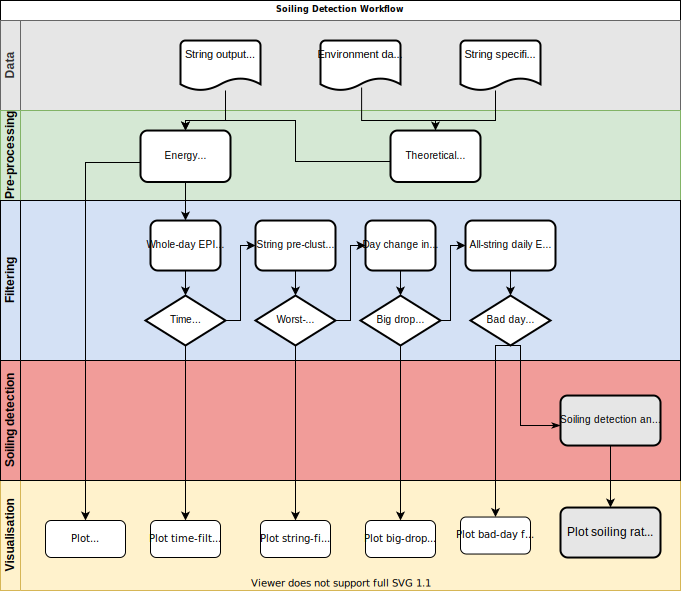

# Estimating soiling losses at photovoltaic plants

This repository contains the final project of Data Science bootcamp at Propulsion Academy in April 2021. 

The project was done in collaboration with [Nispera](https://nispera.com/). 

## Authors

[Lisa Crowther](https://www.linkedin.com/in/lisa-m-crowther/), [Lina Siegrist](https://www.linkedin.com/in/lina-sc/), [Marcus Lindberg](https://www.linkedin.com/in/marcuslindberg/)

## Supervisors

[Badru Stanicki](https://www.linkedin.com/in/badrustanicki/), [Dipanjan Sarkar
](https://www.linkedin.com/in/dipanzan/)

## Installation
A local installation of `conda` is required to set up the project environment.

Using `conda`, install the environment using the provided **`environment.yml`** file as follows:

    conda env create --file environment.yml

If installation was successful, activate your environment and you will be ready to get started.

    conda activate pv_analysis

Please see the respective `readme` in the `/notebooks/` directory for more information the notebooks showcasing parts (or the entirety) of the pipeline.

## Purpose 

The detection of soiling losses at photovoltaic plants and the decision of when to clean the panels is an important business problem. The cost of cleaning the panels at such large scale plants needs to be balanced against the losses in output occurring from soiling. The challenge was to identify output losses that occur due to soiling, in the absence of soiling sensor data that would quantify soiling.

We developed a semi-automated pipeline to analyse photovoltaic panel performance using power output data to detect parkwide soiling related losses, and to further analyse soiling of individual strings of panels to identify clusters of most-soiled strings. This could be useful for recommendations for cleaning and maintenance, allowing soiling detection from power output, temperature and irradiance data alone.

## Data 

- Project data is provided by Nispera. Data is not disclosed because of the NDA.

- For 2 different parks, data is provided as follows.
    - Data of production at string level, with 5 min resolution
    - Data of environmental information(irradiation, ambient temperature and panel temperature) with 5 min resolution

## Flowchart

<!--  -->

## Requirements

The [Environment](environment.yml)
 file contains all the necessary python packages.

