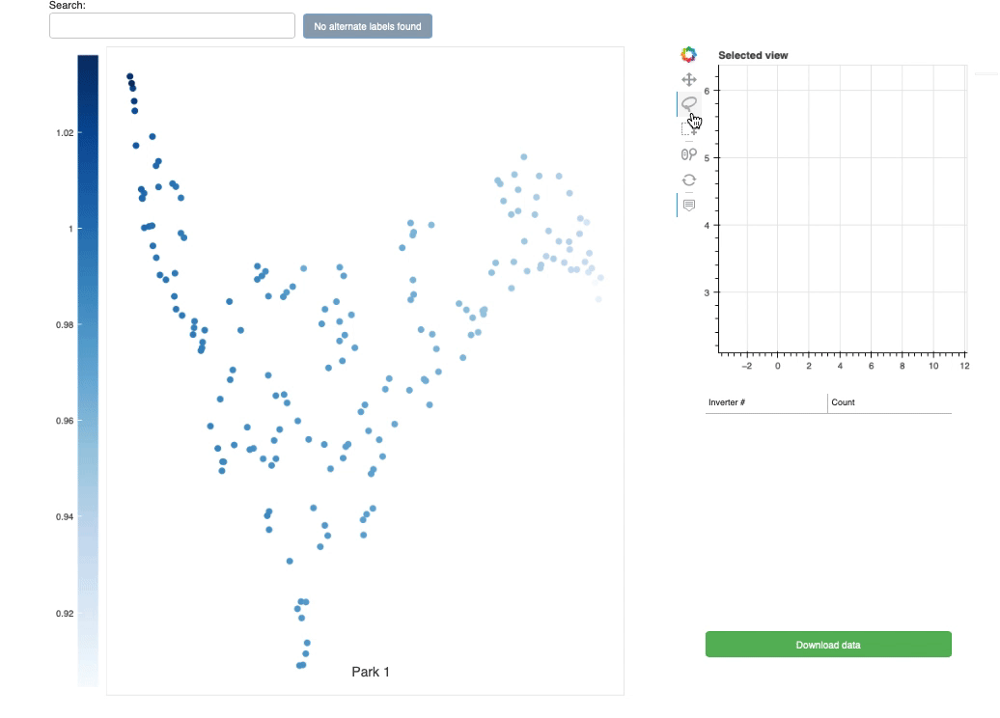

# Description of the notebook

<h2>1. Pipeline notebook</h2>

The pipeline (**ML_run_pipeline.ipynb**) is an automated script where the series of the processes is run through with pre-determined parameters.
  

<h2>2. Individual notebooks</h2>
The steps in the pipeline notebook is splitted into individual notebooks listed below. Those enables parameters to be adjusted (eg. time window, thresholds for filters) and see the outcome at the end on the interactive plots. Thus the outcome of each individual notebook would be the same as the pipeline script, if the same time window is given.
  

- The order of the series of notebooks
  
**1_preprocessing.ipynb**
  
**2_detect_timewindow.ipynb**
  
**3_big_drop_filter.ipynb**
  
**4_bad_day_filter.ipynb**
  
**5_soiling_detection_regression.ipynb**
  
**6_plot_each_step_of_EPI.ipynb**
  
**7_interactive_visualise.ipynb**
  

<h2>3. Output files from individual notebooks</h2>
The pipeline is an automated script where the series of the processes is run through with pre-determined parameters.
  

**1_preprocessing.ipynb**  
**df_output.csv**: output of modules where irradiance is not NA  
**df_EPI.csv**: EPI (energy performance index) where output is divided by theoretical output  
**df_theor_output.csv**:  theoretical output of modules

**2_detect_timewindow.ipynb**
  
**EPI_stringfilt.csv**: EPI with preprocessing (remove bad strings)  
**EPI_timemask.csv**: EPI with preprocessed and time masked

**3_big_drop_filter.ipynb**
  
**EPI_bigdrop_filt.csv**: EPI with preprocessed, time masked and big-drop filtered  
**drop_jump_mask.csv**: boolean dataframe resulting from big-drop filter  
**drop_mask.csv**: boolean dataframe resulting from big-drop and jump filter

**4_bad_day_filter.ipynb**
  
**EPI_dropsfilt_baddayfilt.csv**: EPI with preprocessed, time masked, big-drop filtered and bad-day filtered  
**badday_mask.csv**: boolean dataframe resulting from bad-day filter  

## Additional plotting

**UMAP_clustering_interactive.ipynb** provides an interactive plot for clustering data (e.g. EPI, raw power output, soiling loss, etc.) to see how modules cluster together by similarity computed via the *Uniform Manifold Approximation and Projection* (UMAP) dimensionality reduction technique. 

